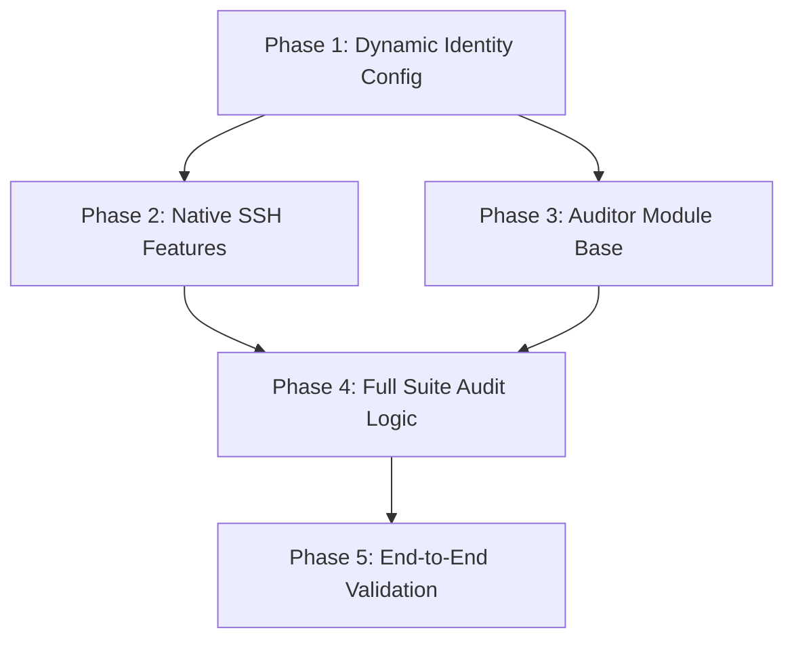

# Implementation Plan: Dynamic Identity & SSH Validation

**Task Complexity**: Complex
**Total Phases**: 5
**Execution Mode**: Ask (Recommendation: Sequential for early phases, Parallel for Audit logic)

## 1. Plan Overview
This plan refactors the devcontainer's user identity to match the host dynamically and introduces a comprehensive Python audit suite to verify tool health and SSH agent forwarding.

## 2. Dependency Graph

## 3. Execution Strategy
| Stage | Phases | Mode | Agent(s) |
|-------|--------|------|----------|
| 1 | 1 | Sequential | `coder` |
| 2 | 2, 3 | Parallel | `devops_engineer`, `coder` |
| 3 | 4 | Sequential | `coder` |
| 4 | 5 | Sequential | `tester` |

## 4. Phase Details

### Phase 1: Dynamic Identity Config
- **Objective**: Refactor Dockerfile and devcontainer.json to pass and apply host identity.
- **Agent**: `coder`
- **Files**:
    - `.devcontainer/devcontainer.json`: Map `${localEnv:USER}`, etc. to buildArgs.
    - `.devcontainer/Dockerfile`: Parameterize user creation.
- **Validation**: Build image locally and verify `id` inside container matches host.

### Phase 2: Native SSH Features
- **Objective**: Enable agent forwarding and config sync.
- **Agent**: `devops_engineer`
- **Files**:
    - `.devcontainer/devcontainer.json`: Enable `forwardAgent`, sync `~/.ssh/config`.
- **Validation**: Container starts and `ssh-add -l` shows host keys.

### Phase 3: Auditor Module Base
- **Objective**: Scaffold the Python `audit` module.
- **Agent**: `coder`
- **Files**:
    - `python/src/dotfiles_setup/audit.py`: Base class and CLI plumbing.
- **Validation**: `ruff` and `mypy` pass on the new module.

### Phase 4: Full Suite Audit Logic
- **Objective**: Implement native tool checks and SSH round-trip.
- **Agent**: `coder`
- **Files**:
    - `python/src/dotfiles_setup/audit.py`: Implement `mise doctor`, `pixi check`, and SSH connection logic.
- **Validation**: Execute audit module from host and verify all checks pass.

### Phase 5: End-to-End Validation
- **Objective**: Verify setup in a clean container.
- **Agent**: `tester`
- **Files**:
    - `tests/test_audit.py`: Verify auditor output.
- **Validation**: Functional tests pass inside the container.

## 5. Cost Summary
| Phase | Agent | Model | Est. Input | Est. Output | Est. Cost |
|-------|-------|-------|-----------|------------|----------|
| 1 | `coder` | Pro | 2500 | 600 | $0.05 |
| 2 | `devops_engineer` | Flash | 2000 | 300 | $0.01 |
| 3 | `coder` | Pro | 2500 | 500 | $0.04 |
| 4 | `coder` | Pro | 4000 | 1200 | $0.09 |
| 5 | `tester` | Flash | 3000 | 600 | $0.01 |
| **Total** | | | **14000** | **3200** | **$0.20** |

## 6. Execution Profile
- **Total phases**: 5
- **Parallelizable**: 2 (Phase 2 & 3)
- **Estimated sequential time**: 40 mins
- **Estimated parallel time**: 30 mins
